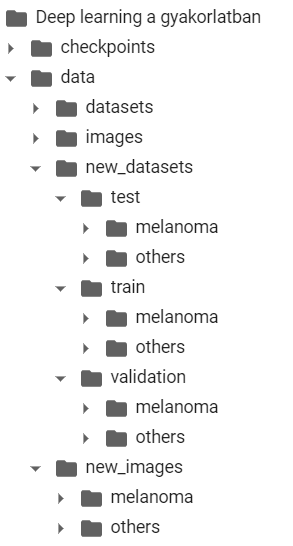

# Melanoma Detection

> Skin cancer detection with artificial intelligence. We analysed different convolutional neural networks for melanoma detection to select the most accurate method for this purpose. In our solution, we used different base models with the same top layers to detect melanoma images from others images.

Bemutató videó: https://youtu.be/qg0tBphAYGA

## Table of contents

* Melanoma Detection
   * Table of contents
   * General info
   * Directory structure and files
   * Technologies
   * Setup
   * Results
   * Contact

## General info

Among skin cancer diseases, melanoma is one of the most common and most dangerous ones, being difficult to detect and causing serious problems once spread deeper. Melanomas have many different shapes, sizes, and colours, thus making it harder to provide comprehensive warning signs. Detecting melanoma early is of utmost importance. Neural Networks provide significant progress in this field, making it possible to detect melanomas with many previously learned patterns, dealing with larger datasets than a human specialist can handle.


## Directory structure and files





The used dataset can be downloaded here:

https://dataverse.harvard.edu/dataset.xhtml?persistentId=doi:10.7910/DVN/DBW86T

The full article is available here:

https://www.nature.com/articles/sdata2018161


## Technologies

- Google Colaboratory
- Google Drive
- Keras
- Python


## Setup

1. Dataset is stored in the drive as shown in the directory structure section.

2. Mount data.

   ```python
   from google.colab import drive
   drive.mount('/content/drive/')
   ```

3. Each developer set their root path.

   ```python
   root_path = '/content/drive/My Drive/example_folder'
   ```

4. To help easier usage both for developers and spectators, we created a logical value called “developer” that sets whether the code will make changes in the structure of the dataset or not. Setting this value to False means every block is safely runnable to look at the results only.

   ```python
   # Set False if you just want to see the results.
   # Set True if you want to make changes in the project.
   developer = False
   ```

5. In our project you can use two different base models, EfficientNetB0 and InceptionV3. Select the desired base model with model_id to train and evaluate the model with the selected base.

   ```python
   # Set 0 if you want to use EfficientNet based model.
   # Set 1 if you want to use InceptionV3 based mofel.
   model_id = 0
   ```

   

## Results

With the current hyperparametrization, the models performed as the followings:

| Base Models    | Loss   | Accuracy |
| -------------- | ------ | -------- |
| EfficientNetB0 | 0.3233 | 87.84 %  |
| InceptionV3    | 0.4101 | 82.43 %  |


## Contact

created by Viktor Horváth, Beatrix Koltai and Adrienn Horváth

QuickMaths

BME Copyright

2020.12.11.
